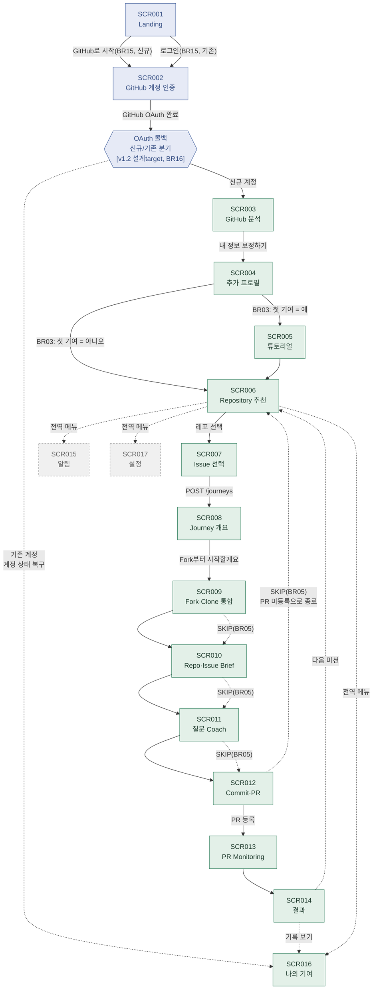

# 그린 커밋(Green Commit) — MVP 정보구조(IA)

기준 기획서: 그린커밋_WEB_서비스_기획서_v1.2.docx · 기준 코드: commit e91bb73(2026-07-19) · 작성일: 2026-07-20
함께 보는 문서: `그린커밋_요구사항정의서_MVP.xlsx`, `그린커밋_화면정의서_MVP.xlsx`, `그린커밋_ERD.dbml`

---

## 범위

router.tsx 기준 실제 라우트 18개(로그인 전 3개 `/`,`/login`,`/auth/callback` + AuthGuard 보호 15개)
중, MVP 기능(F001~F016+F019)이 아닌 SCR015(알림)·SCR017(설정)은 화면 자체는 존재하지만 점선/회색으로
표시해 "지금은 장식/미구현"임을 구분했습니다.

> [정정 2026-07-20] 초판은 이 숫자를 "19개(2+17)"로 잘못 적었고, 아래 사이트맵의 전역 메뉴도
> "3개(알림/기여/설정)"로 적어 실제 TopBar.tsx의 NAV_ITEMS(미션 찾기·나의 기여·알림·설정 4개)와
> 라우트 표(18행) 양쪽 모두와 문서 내부적으로 맞지 않았다. fable 기반 재평가로 발견해 정정.

> [v1.2 반영 2026-07-20] 기획서가 v1.1→v1.2로 개정되며 Landing의 계정 진입 방식이 바뀌었다(BR15·BR16
> 신설): Landing 버튼이 "GitHub로 시작하기"·"오픈소스가 처음이에요"(텍스트만 다르고 둘 다 동일하게
> `/login`으로 가는 현재 코드 그대로)에서 의미가 분리된 "GitHub로 시작"(신규 회원가입)과 "로그인"(기존
> 계정)으로 바뀌고, "오픈소스가 처음이에요" 질문 자체는 Landing에서 빠져 SCR004 추가 프로필로 이동한다.
> 로그인 성공 시 서버가 User·GitHubAccount 존재 여부로 신규/기존을 가르고, 기존 계정이면 프로필·
> 튜토리얼·스킵·자동화 설정·진행 중 Journey·PR Monitoring·History를 계정 단위로 복구한 뒤 곧장
> **SCR016 나의 기여**로 보낸다. 현재 코드(AuthCallbackPage)는 이 분기가 없어 항상 SCR003(GitHub 분석)
> 으로 보내므로, 아래 사이트맵·전이도에 새로 표시한 분기는 전부 `[v1.2 설계target]`이다. 이 갱신은
> 기존 "재방문 경로가 설계에 없음" 메모(요구사항정의서 REQ-003, v1.1 기준으로 목적지를 SCR006이라 잡음)
> 를 대체한다 — v1.2에서는 목적지가 SCR006이 아니라 **SCR016**이다(BR16 참고).

---

## 사이트맵 트리

```
/ (SCR001 Landing, "GitHub로 시작" / "로그인" 2버튼만 — BR15) — 로그인 불필요
└─ /login (SCR002 GitHub 계정 인증) — 로그인 불필요
   └─ (GitHub OAuth) → /auth/callback — 로그인 불필요
      └─ [이하 전부 AuthGuard 보호, 로그인 필수]
         │
         ├─ [v1.2 설계target, BR16] 콜백이 GitHubAccount 기준 User 존재 여부로 분기
         │  └─ [기존 계정] 계정 단위 상태 복구(프로필·튜토리얼·스킵·자동화 설정·진행 중
         │     Journey·PR Monitoring·History) → 온보딩 3단계(분석→프로필→튜토리얼)를
         │     전부 건너뛰고 곧장 /contributions (SCR016 나의 기여)로 이동
         │
         ├─ [신규 계정] /onboarding/analysis (SCR003 GitHub 분석)
         │  └─ /onboarding/profile (SCR004 추가 프로필, "오픈소스가 처음이에요" 질문은
         │     Landing이 아니라 이 화면에서만 물음 — BR15)
         │     ├─ [BR03: 첫 기여 = 예] /onboarding/tutorial (SCR005 튜토리얼)
         │     │  └─ /recommend/repositories (SCR006 추천)
         │     └─ [BR03: 첫 기여 = 아니오] /recommend/repositories (SCR006 추천)
         │
         ├─ /recommend/repositories (SCR006 추천)
         │  └─ /recommend/issues (SCR007 이슈 선택)
         │     └─ [POST /journeys] /journey/overview (SCR008 Journey 개요 — 단계별 스킵 기본값 토글)
         │        └─ /journey/fork (SCR009 Fork·Clone 통합) [SKIP 가능 — BR05]
         │           │  ⚡ 자동화 첫 클릭 시 동의 모달(FORK_AUTOMATION Consent, REQ-015)
         │           └─ /journey/brief (SCR010 Repo·Issue Brief) [SKIP 가능 — BR05]
         │              └─ /journey/coach (SCR011 질문 Coach) [SKIP 가능 — BR05]
         │                 └─ /journey/ship (SCR012 Commit·PR) [SKIP 가능 — BR05, 단 스킵 시 PR
         │                    │  미등록 상태로 Journey 종료(MONITORING 미진입), 아래로]
         │                    ├─ [PR 등록] /journey/monitoring (SCR013 Monitoring, "추적 해제"만
         │                    │   가능·스킵 아님) → /journey/result (SCR014 결과)
         │                    │      ├─ → /recommend/repositories (다음 미션)
         │                    │      └─ → /contributions (기록 보기)
         │                    └─ [스킵=PR 미등록] → /recommend/repositories (다음 미션, 결과 화면
         │                        건너뜀 — REQ-027 참고)
         │
         └─ 전역 메뉴(TopBar NAV_ITEMS, 4개 — 어느 화면에서든 접근 가능)
            ├─ /recommend/repositories (SCR006, "미션 찾기") — 위 Journey 트리와 동일 화면
            ├─ /notifications (SCR015 알림) ┈┈ [범위밖, mock 표시 중]
            ├─ /contributions (SCR016 나의 기여) — History만 실데이터
            └─ /settings (SCR017 설정) ┈┈ [범위밖, 장식용]

         └─ 전역 셸(SCR000, TopBar 자체 — 위 메뉴와 별개로 모든 화면에 항상 렌더링됨)
            ├─ XP/레벨/배지/사고관여 칩 4종 ┈┈ [범위밖, 전부 하드코딩 placeholder]
            └─ 알림 벨의 미읽음 뱃지 "2" ┈┈ [범위밖][코드-스펙 괴리] 하드코딩값, SCR015 mock과 무관하게
               항상 표시됨 — 화면정의서 SCR000 참고
```

---

## 화면 전이도 (Mermaid)



**스킵 경로 참고**: 점선의 `SKIP(BR05)` 화살표는 실제 스킵 버튼이 있는 4개 화면(ForkClone·Brief·
Coach·Ship, 요구사항정의서 REQ-014 매트릭스와 일치)만 표시했다 — 순방향 진행 화살표와 목적지가 같아
보이지만(다음 화면으로 이동), Ship만은 예외로 스킵 시 Monitor를 거치지 않고 곧장 Recommend로 간다.

**범례**: 파란색 = 로그인 전 구간 · 초록색 = MVP로 실제 구현된 구간 · 회색 점선 = 범위밖(화면은 있으나 장식/mock)

---

## 라우트 표

| # | URL 경로 | 화면ID | 화면명 | 인증 | 진입 지점 |
|---|---|---|---|---|---|
| 1 | `/` | SCR001 | Landing | 불필요 | 최초 접속. 버튼 2종: "GitHub로 시작"(신규)/"로그인"(기존) — BR15 |
| 2 | `/login` | SCR002 | GitHub 계정 인증 | 불필요 | Landing 버튼 2종(둘 다 동일 화면·동일 OAuth로 진입, 목적지만 콜백에서 분기) |
| 3 | `/auth/callback` | — | OAuth 콜백 | 불필요 | GitHub 리다이렉트. [v1.2 설계target, BR16] 신규 계정→SCR003, 기존 계정→계정 상태 복구 후 SCR016 직행(현재 코드는 이 분기 없이 항상 SCR003) |
| 4 | `/onboarding/analysis` | SCR003 | GitHub 분석 | 필요 | 로그인 직후(신규 계정) |
| 5 | `/onboarding/profile` | SCR004 | 추가 프로필 | 필요 | SCR003 |
| 6 | `/onboarding/tutorial` | SCR005 | 초보자 튜토리얼 | 필요 | SCR004(BR03=예) |
| 7 | `/recommend/repositories` | SCR006 | Repository 추천 | 필요 | SCR004(BR03=아니오)/SCR005/SCR014/전역메뉴("미션 찾기") |
| 8 | `/recommend/issues` | SCR007 | Issue 선택 | 필요 | SCR006(쿼리스트링 repositoryId 필수, BR04) |
| 9 | `/journey/overview` | SCR008 | Journey 개요 | 필요 | SCR007(Journey 생성 직후) |
| 10 | `/journey/fork` | SCR009 | Fork·Clone 통합 | 필요 | SCR008 |
| 11 | `/journey/brief` | SCR010 | Repo·Issue Brief | 필요 | SCR009 |
| 12 | `/journey/coach` | SCR011 | 질문 Coach | 필요 | SCR010 |
| 13 | `/journey/ship` | SCR012 | Commit·PR | 필요 | SCR011 |
| 14 | `/journey/monitoring` | SCR013 | PR Monitoring | 필요 | SCR012(PR 등록 직후) |
| 15 | `/journey/result` | SCR014 | 결과 | 필요 | SCR013 |
| 16 | `/notifications` | SCR015 | 알림 | 필요 | 전역 메뉴 |
| 17 | `/contributions` | SCR016 | 나의 기여 | 필요 | 전역 메뉴, SCR014, [v1.2 설계target, BR16] 기존 계정 로그인 성공 후 계정 상태 복구 완료 시 기본 진입점 |
| 18 | `/settings` | SCR017 | 설정 | 필요 | 전역 메뉴 |

---

## 네비게이션 구조 메모

- **선형 Journey 구간(SCR006~014)**: 뒤로가기 개념이 명시적 UI로 없음 — 브라우저 뒤로가기는 되지만
  각 화면이 이전 단계 데이터를 다시 물어오는 방식이라 사실상 "이전 단계로 안전하게 돌아가기" 버튼은
  Coach 화면의 "← 접근 다시 고르기"/"← 파일 다시 찾기" 정도만 존재. [설계제안] Journey 구간 전체에
  일관된 뒤로가기 정책이 필요.
- **JourneyRail(사이드바)**: `/journey`로 시작하는 경로에서만 노출되는 보조 네비게이션. 현재는 실제
  진행 상태가 아니라 "지금 URL이 무엇이냐"만으로 하이라이트하는 정적 로직(Phase1 스캐폴드) — 실제
  JourneyStep 상태 연동은 [v1.1 설계target].
- **깊이(Depth)**: 로그인 전 1단계(Landing→Login) → 온보딩 3단계(분석→프로필→튜토리얼, 분기 있음) →
  추천~결과 9단계 선형 Journey → 상시 메뉴 4개(미션찾기/알림/기여/설정)는 깊이 1로 항상 접근 가능.
  전체적으로 "깊이보다 길이"가 긴 구조 — 트리가 아니라 파이프라인에 가까움.
- **재방문 경로가 설계에 없음** [코드-스펙 괴리][중대]: OAuth 콜백(AuthCallbackPage)은 현재 코드상
  신규/기존 사용자를 구분하지 않고 항상 SCR003(GitHub 분석)으로 보낸다. 저장된 프로필을 재조회하는
  GET이 없어 SCR004는 매번 빈 폼으로 뜨고, TutorialProgress를 저장해도(POST /tutorial/progress) 읽는
  API를 프론트가 호출하지 않아 BR03 분기가 로그인할 때마다 처음부터 다시 실행된다 — 이미 튜토리얼을
  마친 첫 기여자도 재로그인하면 튜토리얼을 또 보게 된다. 이 사이트맵엔 "재방문 시 랜딩 지점"(홈/
  대시보드) 자체가 없다는 구조적 공백이 있다. [정정 2026-07-20, 요구사항으로 승격, **v1.2 반영으로
  목적지 정정**] 3차(traceability) 재평가 직후엔 이 해법을 요구사항정의서 REQ-003 기능 칸에 "콜백은
  온보딩 완료 여부를 조회해 기존 사용자를 SCR006으로 직행"이라고 명시했었다. 이후 기획서가 v1.2로
  개정되며 BR15·BR16이 신설돼 목적지가 바뀌었다 — 기존 사용자는 SCR006(추천)이 아니라 **SCR016(나의
  기여)**으로 직행하며, 판단 기준도 "온보딩 완료 여부"가 아니라 "GitHub 식별자로 조회되는 User·
  GitHubAccount 존재 여부"다(BR16). 복구 범위도 튜토리얼 완료 여부 하나가 아니라 프로필·튜토리얼·
  스킵·자동화 설정·진행 중 Journey·PR Monitoring·History 전체다. REQ-003은 이 문서와 함께 v1.2
  기준으로 갱신해야 한다.
- **스킵 가능 구간(BR05)과 그 예외** [정정 2026-07-20]: 위 사이트맵에서 `[SKIP 가능]`으로 표시한
  SCR009(Fork·Clone)·SCR010(Brief)·SCR011(Coach)·SCR012(Commit·PR) 4곳에만 실제 스킵 버튼이 있다
  (부록B는 9단계 전부를 말하지만, MVP는 이 4개 화면 단위로 스킵을 묶는다 — 요구사항정의서 REQ-014
  매트릭스가 이 4곳과 정확히 일치하도록 상호참조돼 있음). SCR012의 스킵만 예외적으로 조심할 지점 —
  "PR 등록 검증은 생략 불가"(BR05)처럼 읽힐 수 있으나 실제로는 "PR 미등록 상태로 Journey를 그냥
  끝낸다"는 뜻이며, MONITORING·RESULT 화면 자체에 들어가지 않는다(REQ-027 참고). SCR013(Monitoring)은
  스킵이 아니라 "추적 해제" 개념이라 이 목록에서 제외했다(부록B-9).
- **자동화 동의 모달** [정정 2026-07-20]: SCR009의 "⚡ 이 단계 자동화하기" 버튼을 처음 누르면 별도
  동의 모달(FORK_AUTOMATION Consent 확인)이 뜬다 — SCR002(로그인)에서는 이 동의를 받지 않는다는 뜻
  이라 트리에 함께 표기했다(REQ-015 참고).
